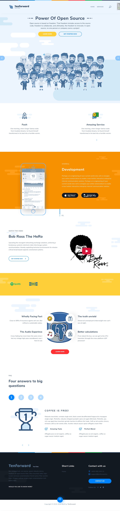
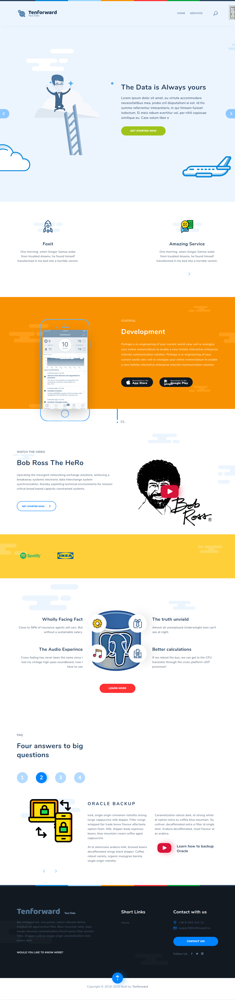

#Tenforward.io

This Wagtail Implementation is the working progress of the website for the Tenforward corporation.

## Current Status
Currently the Homepage/Landing page is working in full, see screencapture below. The development 
of a "writings" page is in progress. This will be the base page for News-, Article- & Blog- posts 

## Quickstart guide

To start woking with this app, simply clone the project, install requirements and start

```bash
$ git clone https://github.com/TenforwardAB/tenforward_io.git
$ cd tenforward_io
$ pipenv shell
$ pip install requirements.txt
$ python manage.py runserver
```

The **default login** is:
`admin/Tenforward`

## License
The project is Licensed as a [MIT](LICENSE) Project and all the images should be free to use since they are created by us,
The Vector images (.svg) should all be licensed under Creative Commons, and they are all downloaded 
from [https://www.flaticon.com/](https://www.flaticon.com/)

## Screenshots

### HomePage
Variation 1


Variation 2
